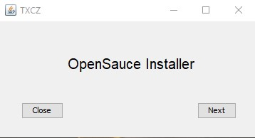
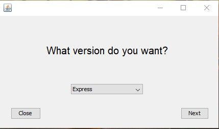
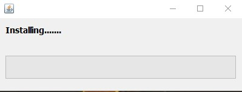

# OpenSauce Installer
OpenSauce Installer is an open source installer written in Java.
You can download the source, edit it and use it.

## Pictures
Start screen after opening



After you can choose between Express, Minimal, Full



Conditions useres need to aggre


Installation of your Programm




## Getting started
1) Download Git
For Debian and Debain based Linux distros:
```
sudo apt install git
```
For Windows & MacOSX download the right version of Git
```
https://git-scm.com/downloads
```

2) Download the source from above. On Linux open bash/terminal and on Windows open Git Bash and write following in the command line:
```
git clone https://GitHub.com/SaschaNes/OpenSauce_Installer
```

3) Download Java JDK 8 for your system
```
https://www.oracle.com/technetwork/java/javase/downloads/jdk8-downloads-2133151.html
```

4) Download NetBeans IDE
```
https://download.netbeans.org/netbeans/8.2/rc/
```
#### Now you can edit the source and compile it with NetBeans!

Copyright (C) Sascha Nesterovic 2019
